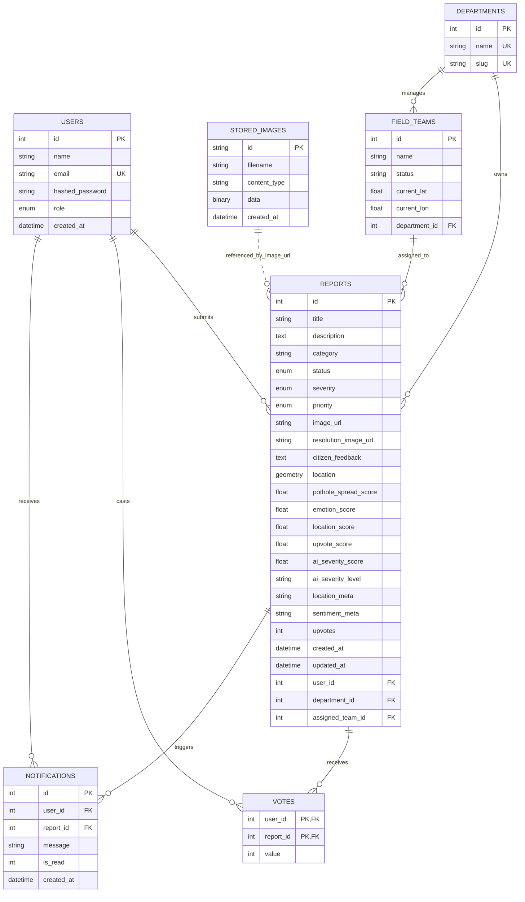
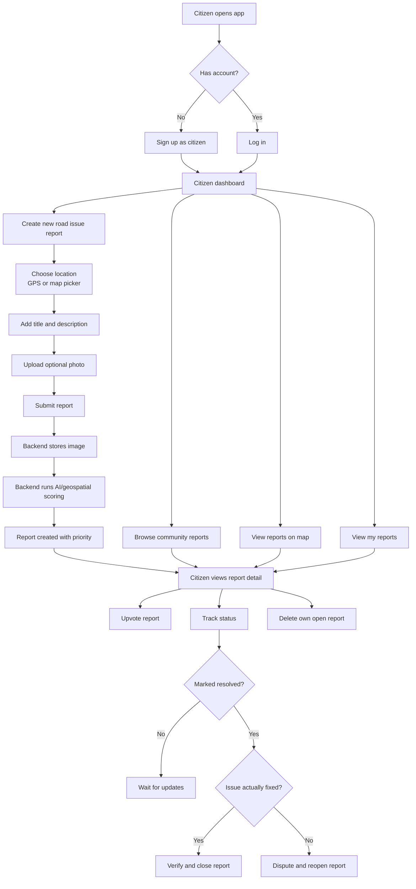
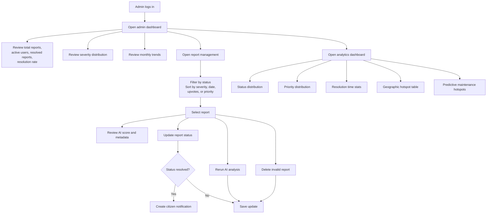
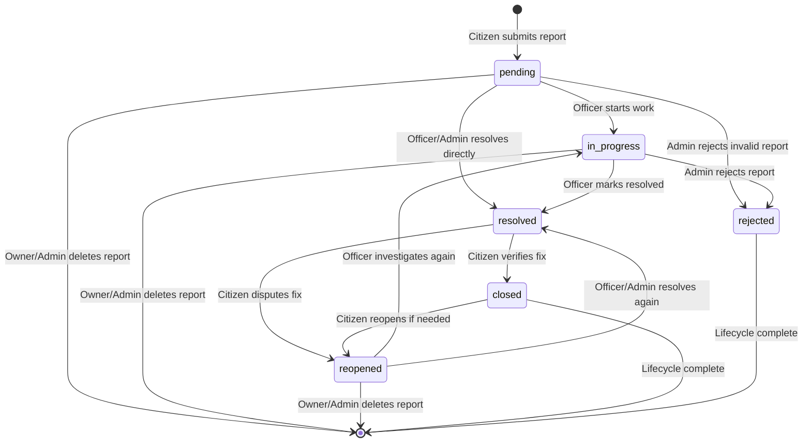
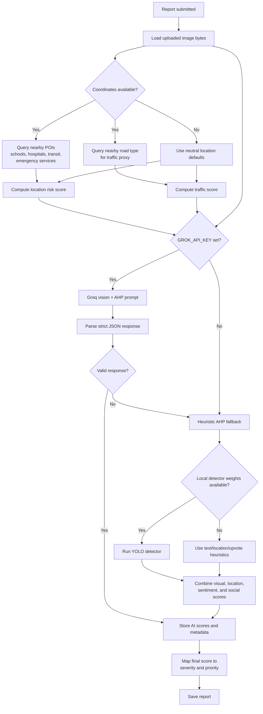

# Architecture Diagrams

This document contains Mermaid diagrams for the Citizen Issue Prioritization and Management System.

## System Architecture

```mermaid
flowchart TB
    subgraph Users["Users"]
        Citizen["Citizen"]
        Officer["Officer"]
        Admin["Admin"]
    end

    subgraph Frontend["React / Vite Frontend"]
        AuthUI["Auth Pages"]
        CitizenUI["Citizen Dashboard\nReport Form\nMap View\nMy Reports"]
        OfficerUI["Officer Dashboard"]
        AdminUI["Admin Dashboard\nReports\nAnalytics"]
        SharedUI["Shared Components\nNavbar, Cards, Badges,\nAI Analysis Card"]
    end

    subgraph Backend["FastAPI Backend"]
        AuthAPI["Auth Router\nJWT + Google OAuth"]
        UploadAPI["Upload Router"]
        ReportsAPI["Reports Router"]
        VotesAPI["Votes Router"]
        AnalyticsAPI["Analytics Router"]
        NotificationsAPI["Notifications Router"]
        UserAPI["User Router"]
        ModelingAPI["Modeling Router"]
        AIScoring["AI Severity Pipeline"]
    end

    subgraph Database["PostgreSQL + PostGIS"]
        UsersTable[("users")]
        ReportsTable[("reports")]
        VotesTable[("votes")]
        NotificationsTable[("notifications")]
        ImagesTable[("stored_images")]
        DepartmentsTable[("departments")]
        TeamsTable[("field_teams")]
    end

    subgraph External["External / Optional Services"]
        Google["Google OAuth"]
        Groq["Groq Vision API\noptional"]
        Overpass["OpenStreetMap Overpass API"]
        LocalYOLO["Local YOLO Detector\noptional weights"]
        MapTiles["OpenStreetMap Tiles\nNominatim Reverse Geocoding"]
    end

    Citizen --> AuthUI
    Citizen --> CitizenUI
    Officer --> OfficerUI
    Admin --> AdminUI

    AuthUI --> AuthAPI
    CitizenUI --> ReportsAPI
    CitizenUI --> UploadAPI
    CitizenUI --> VotesAPI
    CitizenUI --> NotificationsAPI
    CitizenUI --> MapTiles
    OfficerUI --> ReportsAPI
    AdminUI --> AnalyticsAPI
    AdminUI --> ReportsAPI
    AdminUI --> ModelingAPI
    SharedUI --> ReportsAPI

    AuthAPI --> UsersTable
    AuthAPI --> Google
    UserAPI --> UsersTable
    UploadAPI --> ImagesTable
    ReportsAPI --> ReportsTable
    ReportsAPI --> ImagesTable
    ReportsAPI --> NotificationsTable
    ReportsAPI --> AIScoring
    VotesAPI --> VotesTable
    VotesAPI --> ReportsTable
    AnalyticsAPI --> ReportsTable
    AnalyticsAPI --> UsersTable
    AnalyticsAPI --> NotificationsTable
    NotificationsAPI --> NotificationsTable
    ModelingAPI --> LocalYOLO

    AIScoring --> Groq
    AIScoring --> Overpass
    AIScoring --> LocalYOLO
    AIScoring --> ReportsTable
```

## Database Relationships

## User Workflow

## Admin Workflow

## Complaint Lifecycle

## AI Severity Scoring Flow

