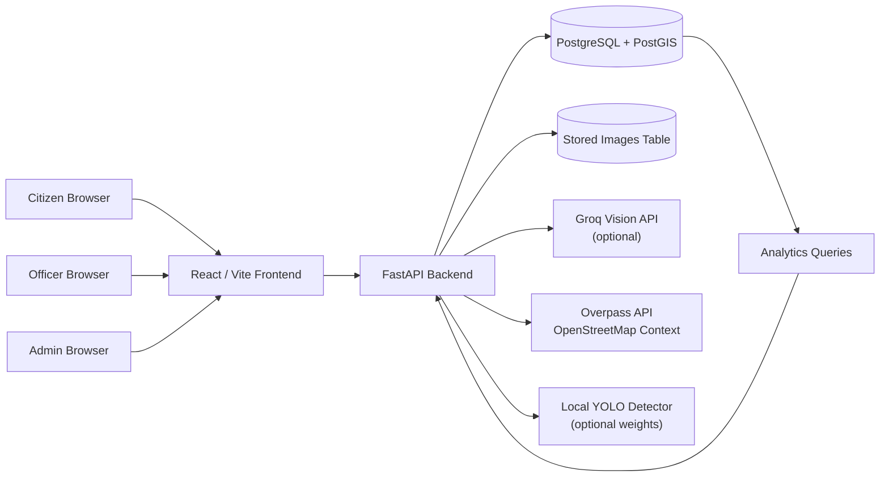
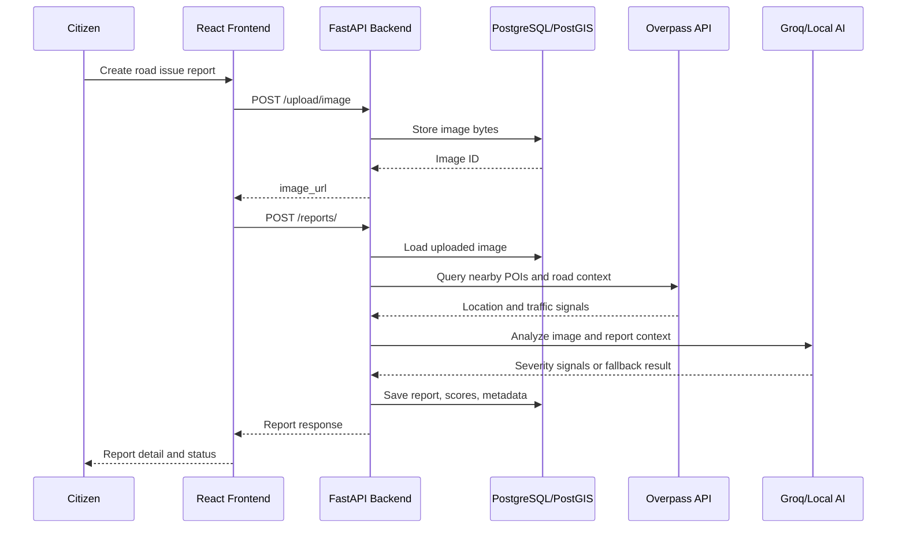

# Citizen Issue Prioritization and Management System

A full-stack civic reporting platform for collecting, prioritizing, tracking, and analyzing citizen-reported road infrastructure issues.

## Overview

Cities receive many road-related complaints, but manual triage often makes it hard to decide which issues should be handled first. Potholes near schools, hospitals, busy roads, or transit points can create higher safety risk than visually similar reports elsewhere. This system brings citizen reporting, geospatial context, AI-assisted severity scoring, and administrative analytics into one workflow.

### Problem

- Citizen complaints are often scattered across informal channels.
- Municipal teams need a consistent way to prioritize repairs.
- Citizens have limited visibility after submitting a report.
- Administrators need dashboards, maps, and analytics to understand city-wide issue patterns.

### Solution

The platform lets citizens submit road issue reports with photos and map coordinates. The backend stores the report, enriches it with geospatial context from OpenStreetMap, optionally analyzes images through an AI vision model, computes severity/priority scores, and exposes dashboards for citizens, officers, and administrators.

### Impact

- Faster road issue reporting and triage.
- More transparent status tracking for citizens.
- Data-driven prioritization for field teams.
- Better visibility into hotspots and recurring civic infrastructure problems.

## Features

Implemented features in this repository:

- Citizen account registration and login.
- Optional Google OAuth login flow.
- Citizen complaint registration for road issues.
- Photo upload for issue evidence.
- Map-based location selection and browser geolocation support.
- AI-assisted severity and priority scoring.
- Geospatial enrichment using nearby infrastructure and road context.
- Community upvoting and downvoting.
- Citizen report feed and personal report history.
- Report detail page with AI analysis breakdown.
- Status tracking across `pending`, `in_progress`, `resolved`, `closed`, `reopened`, and related states.
- Citizen verification or dispute after an officer marks a report resolved.
- Officer dashboard for filtering and updating report status.
- Admin dashboard with summary metrics and severity distribution.
- Admin report management with sorting, filtering, status updates, delete, and reanalysis support.
- Analytics dashboard with status distribution, priority distribution, resolution-time stats, heatmap data, and hotspot table.
- Citizen notifications when a report is marked resolved.
- Docker Compose setup for local frontend, backend, and PostGIS database.
- Render blueprint for hosted deployment.
- ML training workspace for road damage detector and severity model experiments.

## Architecture

### High-Level Architecture



### Data Flow



## Tech Stack

| Layer | Technologies |
| --- | --- |
| Frontend | React 18, Vite, React Router, Axios, Leaflet, React Leaflet, leaflet.heat, Recharts, Lucide React, CSS |
| Backend | Python 3.11, FastAPI, Uvicorn, SQLAlchemy async, Pydantic, python-jose, bcrypt, httpx |
| Database | PostgreSQL, PostGIS, asyncpg |
| AI/ML | Groq OpenAI-compatible vision endpoint, AHP-style severity scoring, OpenStreetMap/Overpass enrichment, optional Ultralytics YOLO, optional ML training scripts |
| Deployment | Docker, Docker Compose, Nginx, Render Blueprint, GitHub Actions |

## Repository Structure

```text
.
|-- backend/                 FastAPI application, routers, models, schemas, AI scoring
|-- frontend/
|   |-- cityreport/           React/Vite frontend application
|   |-- Dockerfile            Frontend build and Nginx serving image
|   |-- nginx.conf            Static SPA routing config
|-- ml/                       Training scripts, dataset tools, labeling docs
|-- ai-ensemble/              Experimental standalone AI scoring service
|-- .github/workflows/        CI/CD workflow
|-- docker-compose.yml        Local full-stack environment
|-- render.yaml               Render deployment blueprint
|-- PROJECT_OVERVIEW.md       Deep architecture analysis
|-- REPOSITORY_AUDIT.md       Repository audit
|-- REFACTOR_CHANGELOG.md     Refactor changelog
```

## Installation

### Prerequisites

- Git
- Docker and Docker Compose
- Node.js 18+ for local frontend development
- Python 3.11+ for local backend development
- PostgreSQL/PostGIS if running without Docker

### Clone

```bash
git clone https://github.com/Shreyas-R-Gowda/Citizen_Issue_Prioritization_and_Management_System.git
cd Citizen_Issue_Prioritization_and_Management_System
```

### Configure Environment

Create a backend environment file:

```bash
cp backend/.env.example backend/.env
```

Edit `backend/.env` with local or production values.

## Environment Variables

### Backend

| Variable | Required | Description | Example |
| --- | --- | --- | --- |
| `DATABASE_URL` | Yes | Async SQLAlchemy database URL | `postgresql+asyncpg://postgres:postgres@db:5432/cityreport` |
| `SECRET_KEY` | Yes | JWT signing secret | `generate-a-long-random-secret` |
| `ALGORITHM` | No | JWT algorithm | `HS256` |
| `ACCESS_TOKEN_EXPIRE_MINUTES` | No | Access token lifetime | `30` |
| `GROK_API_KEY` | No | Enables Groq vision analysis path | `gsk_...` |
| `ALLOWED_ORIGINS` | Production | Comma-separated CORS origins | `https://your-frontend.example.com` |
| `FRONTEND_URL` | OAuth | Frontend URL for auth callback redirects | `http://localhost:3005` |
| `GOOGLE_CLIENT_ID` | OAuth | Google OAuth client ID | `...apps.googleusercontent.com` |
| `GOOGLE_CLIENT_SECRET` | OAuth | Google OAuth client secret | `...` |
| `REDIRECT_URI` | OAuth | Backend Google OAuth callback URL | `http://localhost:8005/auth/google/callback` |
| `ROAD_DETECTOR_WEIGHTS` | Optional | Local YOLO detector `.pt` path | `backend/models/road_detector/best.pt` |
| `ROAD_DEPTH_MODEL` | Optional | Reserved for depth model experiments | Empty by default |
| `ROAD_SEVERITY_MODEL` | Optional | Reserved for learned severity model experiments | Empty by default |
| `ROAD_MODEL_DEVICE` | Optional | Reserved for local model device selection | Empty by default |

### Frontend

| Variable | Required | Description | Example |
| --- | --- | --- | --- |
| `VITE_API_URL` | No | Backend API base URL | `http://localhost:8005` |

## Running Locally

### Option 1: Full Stack With Docker Compose

```bash
docker compose up --build
```

Services:

- Frontend: `http://localhost:3005`
- Backend: `http://localhost:8005`
- Swagger UI: `http://localhost:8005/docs`
- ReDoc: `http://localhost:8005/redoc`
- Postgres: `localhost:5433`

Seed default development data:

```bash
docker compose exec backend python seed_data.py
```

### Option 2: Backend Development

```bash
cd backend
python3 -m venv .venv
source .venv/bin/activate
pip install -r requirements.txt
uvicorn main:app --reload --host 0.0.0.0 --port 8005
```

### Option 3: Frontend Development

```bash
cd frontend/cityreport
npm install
npm run dev
```

By default, the frontend API client uses `http://localhost:8005`.

### Optional ML Dependencies

Only install ML dependencies when training or using local model weights:

```bash
pip install -r backend/requirements-ml.txt
```

Detector training entrypoint:

```bash
python ml/training/train_detector.py --data ml/config/road_damage.dataset.example.yaml
```

See [ml/README.md](ml/README.md) for the full ML workflow.

## API Documentation

Interactive documentation is available when the backend is running:

- Swagger UI: `http://localhost:8005/docs`
- ReDoc: `http://localhost:8005/redoc`

### Authentication

| Method | Endpoint | Auth | Description |
| --- | --- | --- | --- |
| `POST` | `/auth/register` | Public | Register a user |
| `POST` | `/auth/login` | Public | Login with email/password and receive JWT |
| `GET` | `/auth/me` | Bearer token | Get current user |
| `GET` | `/auth/google/login` | Public | Start Google OAuth |
| `GET` | `/auth/google/callback` | Public | Google OAuth callback |

### Users

| Method | Endpoint | Auth | Description |
| --- | --- | --- | --- |
| `GET` | `/users/me` | Bearer token | Get profile |
| `PATCH` | `/users/me` | Bearer token | Update profile |
| `POST` | `/users/me/change-password` | Bearer token | Change password |

### Uploads

| Method | Endpoint | Auth | Description |
| --- | --- | --- | --- |
| `POST` | `/upload/image` | Public in current code | Upload one image |
| `GET` | `/upload/image/{image_id}` | Public in current code | Retrieve uploaded image |

### Reports

| Method | Endpoint | Auth | Description |
| --- | --- | --- | --- |
| `POST` | `/reports/` | Bearer token | Create a road issue report and run severity scoring |
| `GET` | `/reports/` | Public in current code | List road reports with filters, sorting, and pagination |
| `GET` | `/reports/mine` | Bearer token | List current user's reports |
| `GET` | `/reports/{report_id}` | Public in current code | Get report details |
| `POST` | `/reports/{report_id}/verify` | Owner/admin | Verify resolved report and close it |
| `POST` | `/reports/{report_id}/reopen` | Owner/admin | Reopen/dispute a report |
| `POST` | `/reports/{report_id}/reanalyze` | Admin | Rerun AI severity scoring |
| `PATCH` | `/reports/{report_id}/status` | Officer/admin | Update report status |
| `DELETE` | `/reports/{report_id}` | Owner/admin | Delete report |

Report list query parameters:

| Parameter | Description |
| --- | --- |
| `lat`, `lon`, `radius` | Optional radius filter in meters |
| `category` | Report category filter |
| `status` | Status filter |
| `priority` | Priority filter |
| `start_date`, `end_date` | Date range filters |
| `sort_by` | `created_at`, `upvotes`, `priority`, or `ai_severity_score` |
| `sort_order` | `asc` or `desc` |
| `page` | Page number |
| `limit` | Page size, max 200 |

### Votes

| Method | Endpoint | Auth | Description |
| --- | --- | --- | --- |
| `POST` | `/reports/{report_id}/upvote` | Bearer token | Toggle/upsert upvote and recalculate score |
| `POST` | `/reports/{report_id}/downvote` | Bearer token | Toggle/upsert downvote and recalculate score |

### Notifications

| Method | Endpoint | Auth | Description |
| --- | --- | --- | --- |
| `GET` | `/notifications/` | Bearer token | List recent notifications for current user |
| `POST` | `/notifications/{notif_id}/read` | Bearer token | Mark one notification as read |
| `POST` | `/notifications/read-all` | Bearer token | Mark all notifications as read |

### Analytics

| Method | Endpoint | Auth | Description |
| --- | --- | --- | --- |
| `GET` | `/analytics/status-distribution` | Bearer token | Count reports by status |
| `GET` | `/analytics/priority-distribution` | Bearer token | Count reports by priority |
| `GET` | `/analytics/time-bound-stats` | Bearer token | Resolution time buckets |
| `GET` | `/analytics/heatmap-data` | Bearer token | Geographic heatmap points |
| `GET` | `/analytics/trend-analysis` | Bearer token | Report trend data by date |
| `GET` | `/analytics/predictive-maintenance` | Admin | Hotspot recommendations |
| `GET` | `/analytics/summary` | Bearer token | Summary counts and resolution rate |
| `GET` | `/analytics/dashboard` | Bearer token | Admin dashboard aggregate data |

### Model Status

| Method | Endpoint | Auth | Description |
| --- | --- | --- | --- |
| `GET` | `/modeling/status` | Admin | Local road detector status |

## Database Schema

Major entities:

### `users`

Stores registered users.

Key fields:

- `id`
- `name`
- `email`
- `hashed_password`
- `role`: `citizen`, `officer`, or `admin`
- `created_at`

### `reports`

Stores citizen road reports, spatial location, AI scores, status, and workflow metadata.

Key fields:

- `id`
- `title`
- `description`
- `category`
- `status`
- `severity`
- `priority`
- `image_url`
- `resolution_image_url`
- `citizen_feedback`
- `location`: PostGIS `POINT`
- `pothole_spread_score`
- `emotion_score`
- `location_score`
- `upvote_score`
- `ai_severity_score`
- `ai_severity_level`
- `location_meta`
- `sentiment_meta`
- `upvotes`
- `user_id`
- `department_id`
- `assigned_team_id`

### `votes`

Stores one vote per user/report pair.

Key fields:

- `user_id`
- `report_id`
- `value`: `1` for upvote, `-1` for downvote

### `notifications`

Stores citizen notifications, currently used when a report is marked resolved.

Key fields:

- `id`
- `user_id`
- `report_id`
- `message`
- `is_read`
- `created_at`

### `stored_images`

Stores uploaded image bytes in the database.

Key fields:

- `id`
- `filename`
- `content_type`
- `data`
- `created_at`

### `departments` and `field_teams`

Represent civic departments and field teams. The schema exists and reports can reference departments/teams, but the current UI workflow uses only a basic road department assignment path.

## Screenshots

Screenshots are not currently committed. Add images to a future `docs/screenshots/` directory and update the placeholders below.

| Screen | Placeholder |
| --- | --- |
| Welcome / Login | `docs/screenshots/welcome-login.png` |
| Citizen Dashboard | `docs/screenshots/citizen-dashboard.png` |
| New Report Form | `docs/screenshots/new-report.png` |
| Report Detail and AI Analysis | `docs/screenshots/report-detail-ai.png` |
| Map View | `docs/screenshots/map-view.png` |
| Officer Dashboard | `docs/screenshots/officer-dashboard.png` |
| Admin Dashboard | `docs/screenshots/admin-dashboard.png` |
| Analytics Dashboard | `docs/screenshots/analytics-dashboard.png` |

## Deployment

### Docker Compose

Use Docker Compose for local full-stack development:

```bash
docker compose up --build
```

### Render

The repository includes `render.yaml` with:

- Backend web service
- Frontend static service
- Managed PostgreSQL database

Before production deployment, configure:

- `SECRET_KEY`
- `DATABASE_URL`
- `GROK_API_KEY` if AI vision scoring is needed
- `ALLOWED_ORIGINS`
- `FRONTEND_URL`
- Google OAuth variables if Google login is enabled

## Testing and Validation

Current lightweight checks:

```bash
python3 -m compileall -q backend ai-ensemble ml
cd frontend/cityreport
npm run build
```

The repository currently has limited automated tests. A production-grade setup should add:

- Backend API tests
- Database integration tests
- Frontend component tests
- End-to-end workflow tests
- Security and dependency scanning

## Documentation

Additional generated project documents:

- [Project Overview](PROJECT_OVERVIEW.md)
- [Repository Audit](REPOSITORY_AUDIT.md)
- [Refactor Changelog](REFACTOR_CHANGELOG.md)
- [ML Workspace Guide](ml/README.md)

## Future Enhancements

- Add Alembic migrations and remove schema mutation from app startup.
- Move image storage from PostgreSQL blobs to object storage.
- Add upload authorization, file scanning, and image size/type enforcement.
- Add rate limiting for auth, uploads, reports, votes, and AI endpoints.
- Replace query-string OAuth token handling with secure session/cookie flow.
- Add approval workflow for officer/admin accounts.
- Add field-team assignment workflows and audit logs.
- Move AI analysis to background jobs with retry/failure states.
- Add WebSocket/SSE or push notifications.
- Add map clustering and larger-scale geospatial indexing.
- Add screenshots, demo video, and production deployment guide.
- Add complete automated test coverage.

## Contributors

Maintainer:

- [Shreyas-R-Gowda](https://github.com/Shreyas-R-Gowda)

Original upstream source:

- [shankar0311/civic-final](https://github.com/shankar0311/civic-final)

## License

No license file is currently included in this repository.

Before public production or open-source distribution, add a `LICENSE` file and update this section with the selected license, such as MIT, Apache-2.0, or another license appropriate for the project.
